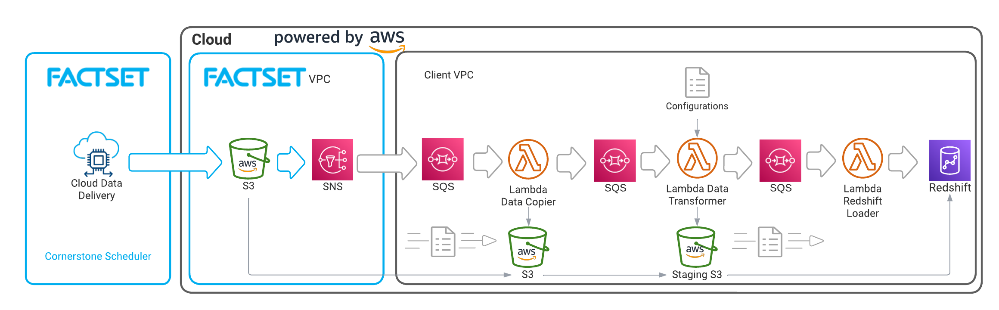

# Overview



S3-Redshift-Loader loads data from an AWS S3 bucket the data provider owns to your AWS Redshift instance. To achieve the goal, it will create IAM roles, S3 buckets, Simple Queue Service (SQS) queues, Lambda functions, a RedShift cluster, a Simple Notification Service (SNS) topic, and CloudWatch alarms to automate the workflow end-to-end with a loosely coupled architecture.

There are four steps to set up the full pipeline. In the beginning, we recommend the users to go through step by step from step 1 to 4. Moving forward, any changes to the Lambda you make will only affect step 3, which means you will need to only deploy the step 3 without touching any other steps. Scroll down to see the details of each step. 

# Requirements
## [Python 3.9](https://www.python.org/downloads/)
The runtime for Lambda functions is set to Python 3.9. When you test locally or in a container, using a different version of Python may cause an issue.

## [Terraform >= 0.13](https://www.terraform.io/downloads.html)

## AWS Credentials
You must store the AWS credentials in the *credentials* file, usually in the *.aws* directory, or set them as [environment variables](#set-aws-credentials).

## VPC and Subnets
This project uses a Virtual Private Cloud (VPC) and subnets. Create a VPC beforehand and **set SQS as an endpoint**. If a VPC is unnecessary, remove all the logic around the VPC.

# Deployment
## Step 1. [IAM Role Creator Module](step_1-iam_role_creator/README.md) (Optional)
This is an one-time deployment step that creates an IAM role with an appropriate access policy to subscribe data provider’s SNS topic and copy the data from the provider's S3. On successful execution terraform script will output the IAM Role ARN. Add the IAM role ARN to *var.tfvars* in Step 2, 3, and 4. If you already have a role with the proper IAM policy, you can skip running this module and follow the next instruction.

> Before executing the rest of the process, please share the IAM Role ARN with your data provider to grant access to their resources from your account. Once the provider grants access, they should share the S3-alias and SNS Topic ARN. Set them as *data_source_access_point_alias* and *data_source_sns_arn* in your tfvars file and switch the *run_only_iam_creator* value to false to deploy the entire pipeline.

## Step 2. [Redshift Cluster Creator Module](step_2-rs_cluster_creator/README.md) (Optional)
This is an one-time deployment step that creates a Redshift cluster, database, username, and password. On successful execution terraform script will output the Redshift DNS name and Redshift security group IDs. Add the output values to *var.tfvars* in Step 3. If you already have a Redshift cluster set up with security group, you can skip running this module.

## Step 3. [Pipeline Builder](step_3-pipeline_builder/README.md)
### [Data Copier Module](step_3-pipeline_builder/modules/data_copier/README.md)
It listens to the data provider's SNS topic, copies relevant data into your bucket, and triggers *data_transformer* SQS.

#### Notes
- It publishes a message to the *data_transformer* SQS only when [data file(txt file)](#data-transformer-module) is delivered.
- It assumes that there are specific directories to watch within the provider's S3 bucket. For instance, your provider created a directory called *relevant_data_to_abc* to store data that is relevant to you. Add *relevant_data_to_abc* to a global variable *TARGET_DIRS* in the *data_copier* Lambda script to copy data stored in a specific directory.

### [Data Transformer Module](modules/data_transformer/README.md)
- Parses data and schema (**both are required**).
- Converts data column headers to Redshif-friendly names.
- Sets SQL data types per column based on the schema.
- Maps each data row with a Redshift table, its final destination in RedShift.
- Removes existing rows with matching lookup column value for re-statement if Redshift tables exist.
- Save data per Redshift table as a gzip file in the staging S3 bucket.
- Publish a message to the *rs_loader* SQS.

#### Notes
- Two files are expected per data set with supported file types and structures:
    - Data: *txt* file(.txt) with *pipe*(|) as a delimiter
    - Schema: *json* file(.json) with the following structure
        ```json
        {
        "fields": [
            {
            "name": "column_header",
            "type": "column_data_type"
            },
        ]
        }
        ```
- If a schema file is not delivered, it will re-try to retrieve the schema file a few times and eventually raise an exception.
- It uses a configuration file, *cfg.csv*, for data-table mapping.
- It uses a column, *Report Type*, for the date-table mapping in the cfg file.
- Redshift only allows letter, @, \_, or \# as a first character of the column name. If this requirement is not met, `_get_rs_column_name()` adds "_" to the front of the name.
- Redshift column name should be less than 127 bytes. If the name is longer, Redshift will truncate it to 127 bytes.
- Required data file columns have to be included in `REQUIRED_COLS` in Lambda.
- It processes data in chunk to support large data set efficiently. The chunk size can be set as `CHUNK_SIZE` in Lambda.
- It uses a column, *Output ID*, to handle re-statement.
- It only supports *varchar(max)* and *float* SQL data types to reduce complexity around various data types.
- Lambda has up to 15-minute timeout restriction and memory restriction which can cause problem when processing large data.

### [Redshift Loader Module](modules/redshift_loader/README.md)
It prepares a Redshift table for data to be copied, including creating a table if it does not exist and adding new columns, copies the data, and deletes the used staging file.

## Step 4. [SNS Subscriber](step_4-sns_subscriber/README.md)
This is an one-time deployment step that subscribes the data source's SNS topic. This step has to be run after the data source granted a permission to your IAM role to access their resources.

# Development
## Set AWS credentials
```shell
export AWS_ACCESS_KEY_ID=[your_aws_access_key_id]
export AWS_SECRET_ACCESS_KEY=[your_aws_secret_access_key]
export AWS_SESSION_TOKEN=[your_aws_session_token]
```

## Initialize Terraform
Go to the step you want to deploy. Then, run the following commands.
```shell
terraform init
```

## Preview Terraform's plan
```shell
terraform plan -var-file="var.tfvars" # var file should be created by you
```

## Apply Terraform's plan
```shell
terraform apply -auto-approve -var-file="var.tfvars"
```

## Destroy Terraform application
```shell
terraform destroy -auto-approve -var-file="var.tfvars"
```

# Copyright

Copyright 2023 FactSet Research Systems Inc

Licensed under the Apache License, Version 2.0 (the "License");
you may not use this file except in compliance with the License.
You may obtain a copy of the License at

    http://www.apache.org/licenses/LICENSE-2.0

Unless required by applicable law or agreed to in writing, software
distributed under the License is distributed on an "AS IS" BASIS,
WITHOUT WARRANTIES OR CONDITIONS OF ANY KIND, either express or implied.
See the License for the specific language governing permissions and
limitations under the License.